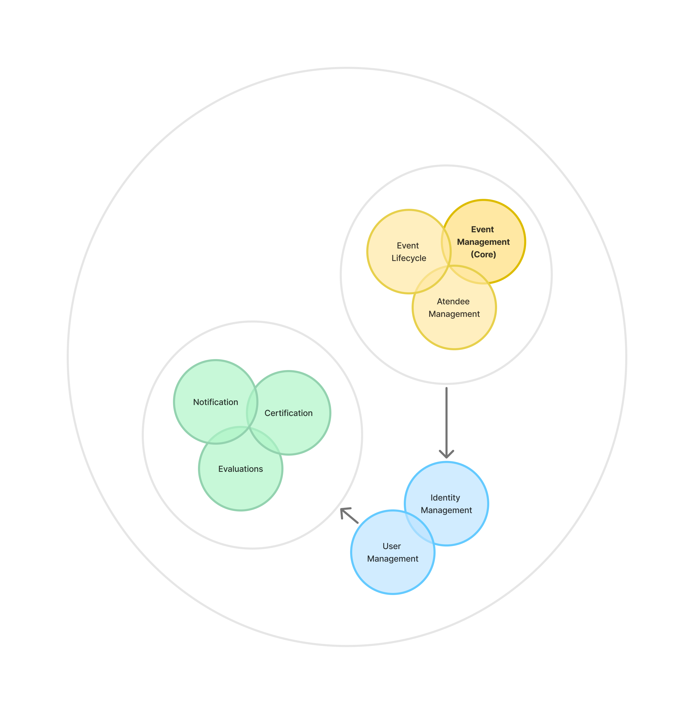

| Tema            | Arquitetura |
| --------------- | ----------- |
| Data de criação | 25/08/2024  |
| Responsável     | @vieira-a   |
| Data de revisão | 28/08/2024  |
| Versão          | 01          |

## Visão geral

O objetivo deste documento é definir claramente as áreas de responsabilidade dentro do sistema **Unievents**. Cada contexto limitado contém um conjunto bem definido de responsabilidades e limites, reduzindo a ambiguidade sobre o que cada parte do sistema deve fazer. A separação dos contextos e suas limitações facilitará a modularização do sistema.

## Contextos Limitados

1. Event Management: este será o contexto principal, responsável pela criação e gerenciamento de eventos. Configura detalhes como: data, local e informações gerais do evento.

2. Atendee Management: este contexto gerencia as inscrições dos participantes, comunicação e check-in nos eventos.

3. Event Lifecycle: este contexto é responsável pelo acompanhamento e registro do cliclo de vida completo dos eventos, desde a criação até conclusão e emissão de relatórios.

4. Notification: contexto responsável por notificar participentes acerca de novos eventos, bem como enviar solicitações de avaliação e certificados de participação.

5. Evaluations: este contexto é responsável por gerenciar as avaliações de eventos enviadas pelos participantes.

6. Certification: contexto responsável por emitir certificados de participação para os participantes dos eventos.

7. Identity Management: este contexto é responsável pela autenticação e autorização de usuários, garantindo acesso seguro aos serviços.

8. User Management: contexto responsável por gerenciar os perfis de usuários.

## Benefícios esperados

- Clareza na Separação de Responsabilidades
- Facilitar a Comunicação e Alinhamento
- Redução de Acoplamento
- Facilita a Escalabilidade

## CHANGELOG

| Data       | Descrição                                                         |
| ---------- | ----------------------------------------------------------------- |
| 28/08/2024 | Renomeia contexto: Participant Management para Atendee Management |
| 28/08/2024 | Renomeia contexto: Reviews and Ratings para Evaluations           |
