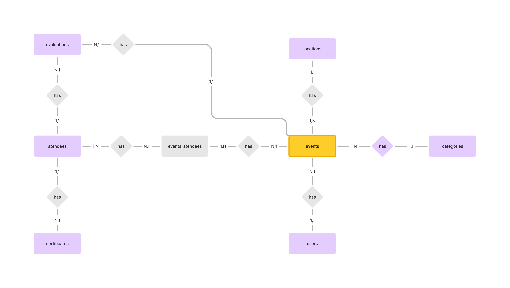

| Tema            | Banco de dados |
| --------------- | -------------- |
| Data de criação | 28/08/2024     |
| Responsável     | @otiodarth     |
| Data de revisão | 28/08/2024     |
| Versão          | 00             |

## Visão geral

O objetivo deste documento é apresentar os modelos de dados conceitual, lógico e físico da aplicação **Unievents**.

## Modelo conceitual

1. Events: tabela responsável por armazenar informações sobre os eventos.

2. Categories: tabela responsável por armazenar informações sobre as categorias/tipos de eventos.

3. Locations: tabela responsável por armazenar informações sobre os locais em que os eventos acontecem.

4. Atendees: tabela responsável por armazenar informações sobre os participantes de eventos.

5. Events_Atendees: tabela de associação responsável por armazenar informações de eventos dos quais o usuário participou.

6. Users: tabela responsável por armazenar informações sobre os usuários do sistema a nível administrativo.

7. Evaluations: este contexto é responsável por gerenciar as avaliações de eventos enviadas pelos participantes.

8. Certificates: tabela responsável por armazenar a URL dos certificados dos participantes.

### Associações

- Events > Users (1,1)
- Events > Atendees (N,N)
- Events > Evaluations (1,N)
- Events > Categories (1,1)
- Events > Locations (1,1)
- Atendees > Certificates (1,N)
- Atendees > Evaluations (1,N)

## Benefícios esperados

- Clareza na modelagem de dados
- Facilitar a Comunicação e Alinhamento

## CHANGELOG

| Data | Descrição |
| ---- | --------- |
|      |           |
